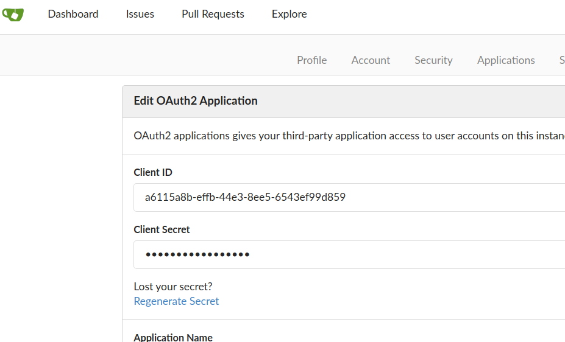
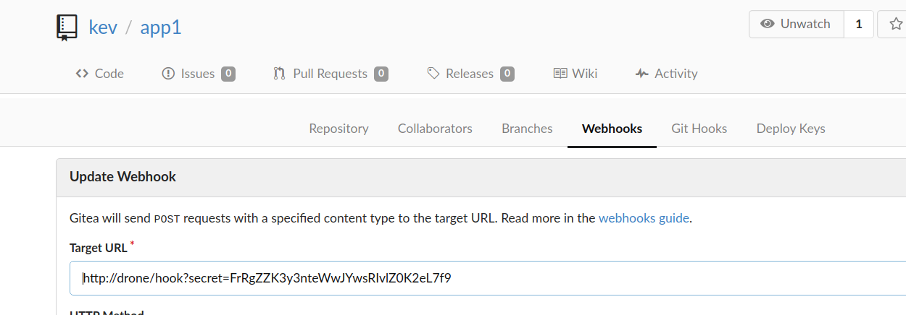
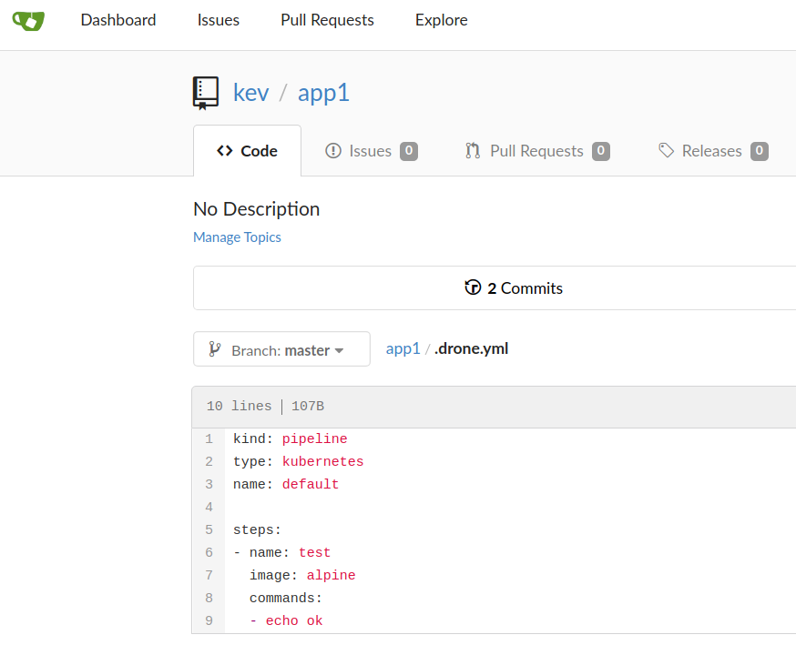

# Installation

### Prerequisite

* Linux machine

* Not Mac, why ?
  *  **Cause docker on Mac is not directly run on mac but through [xhyve](https://github.com/machyve/xhyve)**
  * docker network is not exposed on local box
  * However it is possible to tweak k3d arguments to get this works, to be resolved


Help youself install docker,k3d,helm3 and kubectl

```
#My installation
docker --version && kubectl version --short && helm version --short && k3d version

Docker version 20.10.7, build f0df350
Client Version: v1.17.3
Server Version: v1.21.1+k3s1
v3.1.1+gafe7058
k3d version v4.4.6
k3s version v1.21.1-k3s1 (default)
```


### start k3s cluster

```
k3d cluster create cicd -a 2  -p 9000:80@loadbalancer

export KUBECONFIG="$(k3d kubeconfig write cicd)"


k3d cluster ls
NAME   SERVERS   AGENTS   LOADBALANCER
cicd   1/1       2/2      true

k3d node ls 
NAME                ROLE           CLUSTER   STATUS
k3d-cicd-agent-0    agent          cicd      running
k3d-cicd-agent-1    agent          cicd      running
k3d-cicd-server-0   server         cicd      running
k3d-cicd-serverlb   loadbalancer   cicd      running

docker ps --format "{{.Names}}\t{{.Status}}\t{{.Ports}}"

k3d-cicd-serverlb	Up 3 minutes	0.0.0.0:9000->80/tcp, :::9000->80/tcp, 0.0.0.0:44561->6443/tcp
k3d-cicd-agent-1	Up 4 minutes	
k3d-cicd-agent-0	Up 4 minutes	
k3d-cicd-server-0	Up 4 minutes


```


### Enable k8s dashboard

As for local demo or understanding I choose install non-ssl dashboard by

`kubectl apply -f https://raw.githubusercontent.com/kubernetes/dashboard/v2.3.1/aio/deploy/alternative.yaml`

Choose to create path based ingress rather than use kubectl proxy , view [dashboard.yaml](./dashboard.yaml) [dashboardrole.yaml](./dashboardrole.yaml)


`kubectl apply -f dashboard.yaml`

`kubectl apply -f dashboardrole.yaml`

Access dashboard with token of deafult user (don't miss the `/` in the end of URL) , here I assign cluster permission to default user

http://localhost:9000/

get token by

`kubectl -n kubernetes-dashboard describe secret $(kubectl -n kubernetes-dashboard get secret | grep default | awk '{print $1}') | grep token:`


### install gitea & drone

#### gitea
```
# 3rd party not official chart
helm repo add k8s-land https://charts.k8s.land
# official drone chart
helm repo add drone https://charts.drone.io

kubectl create namespace drone
```
view [gitea-values.yaml](./gitea-values.yaml)

```
helm install --namespace drone -f gitea-values.yaml gitea k8s-land/gitea

```

create service for drone to access

view [gitea-service.yaml](./gitea-service.yaml)

```
kubectl apply -f gitea-service.yaml
```
add traefik cluster ip to /etc/hosts to resolve gitea and drone

```
echo "$(k get svc traefik -n kube-system -o jsonpath='{.status.loadBalancer.ingress[0].ip}')\tgitea" | sudo tee -a /etc/hosts
echo "$(k get svc traefik -n kube-system -o jsonpath='{.status.loadBalancer.ingress[0].ip}')\tdrone" | sudo tee -a /etc/hosts
```

access http://gitea

Finish web installation by enter sign in for the first time.

reference https://docs.drone.io/server/provider/gitea/ to create oauth application for drone ,

entering Redirect URI with http://drone/login , copy client id and secret to [drone.yaml](./drone.yaml)

#### drone & runners
```

helm install --namespace drone drone drone/drone -f drone.yaml

```
creat ingress for drone as it is not configured in helm chart, view [droneingress.yaml](./droneingress.yaml)
```
kubectl apply -f droneingress.yaml
```
Access http://drone

note **hosts file has be done along with gitea in above steps**

login via oauth gitea , assume you have login gitea


**install drone runner before you run any job**

view [dronerunner.yaml](./dronerunner.yaml)
```

helm install --namespace drone drone-runner-kube drone/drone-runner-kube -f dronerunner.yaml

```

### Verify installation

```
# verify helm installation

helm list -n drone
NAME             	NAMESPACE	REVISION	UPDATED                                 	STATUS  	CHART                  	APP VERSION
drone            	drone    	1       	2020-03-17 21:06:20.643125706 +1100 AEDT	deployed	drone-0.1.3            	1.6.5      
drone-runner-kube	drone    	1       	2020-03-17 21:07:44.847308658 +1100 AEDT	deployed	drone-runner-kube-0.1.2	1.0.0      
gitea            	drone    	1       	2020-03-17 20:58:35.789637113 +1100 AEDT	deployed	gitea-1.2.3            	1.10.1

# verify service deployed

kubectl get svc -n drone
NAME                TYPE           CLUSTER-IP      EXTERNAL-IP   PORT(S)        AGE
gitea-gitea-http    ClusterIP      10.43.251.201   <none>        3000/TCP       19h
gitea-mariadb       ClusterIP      10.43.126.82    <none>        3306/TCP       19h
gitea               ClusterIP      10.43.160.207   <none>        80/TCP         19h
drone               ClusterIP      10.43.62.20     <none>        80/TCP         19h
drone-runner-kube   ClusterIP      10.43.119.188   <none>        3000/TCP       19h
gitea-gitea-ssh     LoadBalancer   10.43.136.53    172.19.0.3    22:30436/TCP   19h

# verify endpoints deployed

kubectl get endpoints -n drone
NAME                ENDPOINTS         AGE
drone-runner-kube   10.42.2.36:3000   19h
drone               10.42.2.35:80     19h
gitea-mariadb       10.42.0.33:3306   19h
gitea               10.42.1.33:3000   19h
gitea-gitea-http    10.42.1.33:3000   19h
gitea-gitea-ssh     10.42.1.33:22     19h

# verify ingress created

kubectl get ingresses.extensions -n drone
NAME          HOSTS   ADDRESS      PORTS   AGE
drone         drone   172.19.0.2   80      20h
gitea-gitea   gitea   172.19.0.2   80      19h

# verify pods

kubectl get po -n drone
NAME                                READY   STATUS    RESTARTS   AGE
svclb-gitea-gitea-ssh-xdqj8         1/1     Running   1          20h
drone-6788d97cc6-fbcxc              1/1     Running   1          19h
drone-runner-kube-cddf8c48f-7nvcp   1/1     Running   1          19h
svclb-gitea-gitea-ssh-z9wh9         1/1     Running   1          20h
svclb-gitea-gitea-ssh-tlphd         1/1     Running   1          20h
gitea-mariadb-0                     1/1     Running   1          20h
gitea-gitea-84464cfcbb-fvbrq        2/2     Running   2          20h
```

go http://gitea create repo add [.drone.yml](./.drone.yml) to that repo

go http://drone sync repo , then activate that repo

go http://gitea check that repo's setting , a webhook should be created

make commit of repo , the build should trigger automaticly from drone.

:beer::beer::beer:

### Screenshot of installation

| Steps             | Screen |
:-------------------------|:-------------------------
gitea oauth | 
repo webhook | 
drone pipeline | 
drone build | 


### Trouble shooting if something gone wrong

* Always run `kubectl get events -A -w` screen issues

* `kubectl logs` to check pod logs

* Kube DNS check `kubectl run -it --rm --restart=Never busybox --image=busybox:1.28 -- nslookup $YOUR_DNS_NAME_WITH_NAMESPACE`

* `kubectl describe svc` & `kubectl describe endpoint`

* logon to the k3s instance (docker)
  * `docker exec -ti k3d-cicd-server /bin/sh` and ` docker exec -ti k3d-cicd-worker-0 /bin/sh`
  * remeber k3s is not using docker but containerd. `crictl` is your friends.

more to add
