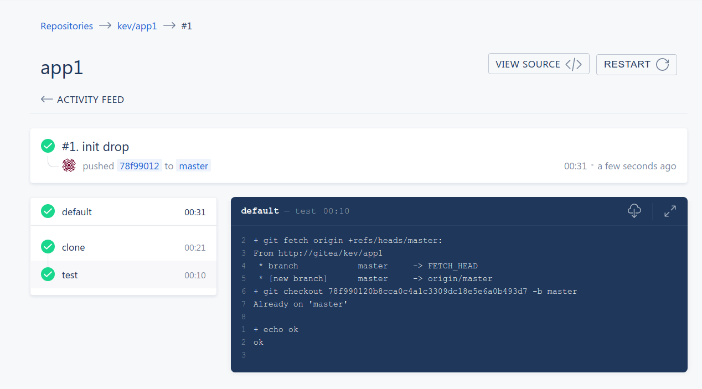

# Playing Drone and gitea on local with k3d(k3s)

### Prerequisite

docker on Linux machine not Macbook , why ?

Help youself install k3d,helm3 and kubectl

```
#My installation
kubectl version --short && helm version --short && k3d version

Client Version: v1.17.3
Server Version: v1.17.2+k3s1
v3.1.1+gafe7058
k3d version v1.6.0
k3s version v1.17.2-k3s1
```


### start k3s cluster

```
k3d create --name cicd -p 9000:80 --workers 2

export KUBECONFIG="$(k3d get-kubeconfig --name='cicd')"

k3d list
+-------+------------------------------------+---------+---------+
| NAME  |               IMAGE                | STATUS  | WORKERS |
+-------+------------------------------------+---------+---------+
| cicd  | docker.io/rancher/k3s:v1.17.2-k3s1 | running |   2/2   |
+-------+------------------------------------+---------+---------+

```


### Enable k8s dashboard

As for local demo or understanding I choose install non-ssl dashboard by

`kubectl apply -f https://raw.githubusercontent.com/kubernetes/dashboard/v2.0.0-beta8/aio/deploy/alternative.yaml`

Choose to create path based ingress rather than use kubectl proxy , view [dashboard.yaml](./dashboard.yaml) [dashboardrole.yaml](./dashboardrole.yaml)


`kubectl apply -f dashboard.yaml`

`kubectl apply -f dashboardrole.yaml`

Access dashboard with token of deafult user (don't miss the `/` in the end of URL) , here I assign cluster to default user

http://localhost:9000/kubernetes-dashboard/

get token by

`kubectl -n kubernetes-dashboard describe secret $(kubectl -n kubernetes-dashboard get secret | grep default | awk '{print $1}')`


### Enable traefik dashboard (optional)

http://localhost:9000/kubernetes-dashboard/#/customresourcedefinition/helmcharts.helm.cattle.io/kube-system/traefik?namespace=_all

add `dashboard.enabled: 'true'` to spec/set

creat ingress for traefik dashboard, view [traefikdashboardrole.yaml](./traefikdashboardrole.yaml)

access it by

http://localhost:9000/traefik-dashboard

`kubectl apply -f traefikdashboard.yaml`

### install gitea & drone

#### gitea
```
helm repo add k8s-land https://charts.k8s.land
helm repo add drone https://charts.drone.io

kubectl create namespace drone
```
view [gitea-values.yaml](./gitea-values.yaml)

```
helm install --namespace drone -f gitea-values.yaml gitea k8s-land/gitea

```

create another service for drone later

view [gitea-service.yaml](./gitea-service.yaml)

```
kubectl apply -f gitea-service.yaml
```
add traefik_cluster_ip to /etc/hosts

```
$traefik_cluster_ip  gitea
$traefik_cluster_ip  drone
```

access http://gitea

Finish web installation by enter sign in for the first time.

modify Gitea Base URL from `http://gitea.local` to `http://gitea/`

reference https://docs.drone.io/server/provider/gitea/ to create oauth application for drone ,

entering Redirect URI with http://drone/login , copy client id and secret to [drone.yaml](./drone.yaml)

#### drone & runners
```

helm install --namespace drone drone drone/drone -f drone.yaml

```
creat ingress for drone as it not configured in helm chart, view [droneingress.yaml](./droneingress.yaml)
```
kubectl apply -f droneingress.yaml
```
Access http://drone

note **hosts file has be done along with gitea in above steps**

login via oauth gitea , assume you have login gitea


**install drone runner before you run any job**

view [dronerunner.yaml](./dronerunner.yaml)
```

helm install --namespace drone drone-runner-kube drone/drone-runner-kube -f dronerunner.yaml


```

go http://gitea create repo add [.drone.yml](./.drone.yml) to that repo

go http://drone sync repo , then activate that repo

go http://gitea check that repo's setting , a webhook should be created

make commit of repo , the build should trigger automaticly from drone.



:beer::beer::beer:
